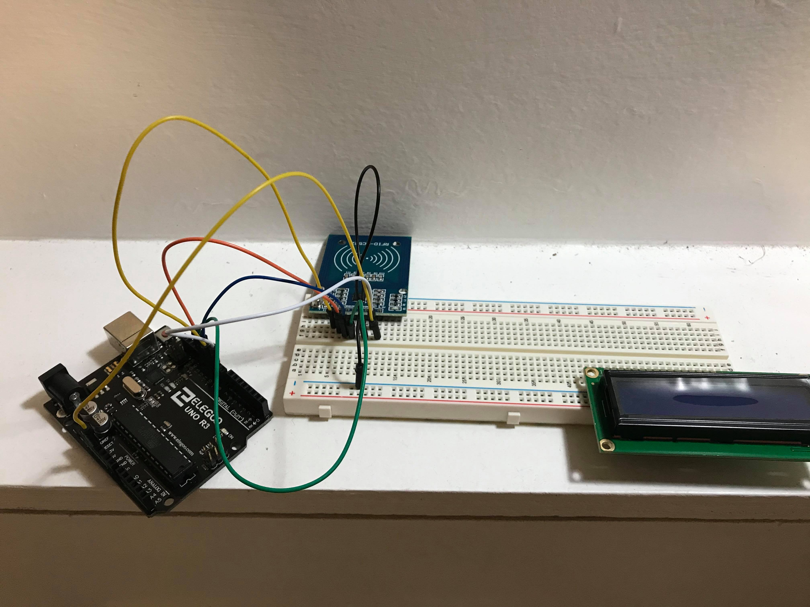

# Entry 3
##### 1/5/2020

### Updates and Sources I am using to build my prototype
Since my last blog entry2, I had purchased the Arduino kit and the RFID module. With some of the main components available to me, I could start building the prototype system and testing the RFID module out. I have been working on researching related projects or articles about Arduino RFID smart lock system.
I had found a project that someone posted about their Arduino RFID smart lock system project,
[in this person's project](https://create.arduino.cc/projecthub/user8523373/rfid-based-automatic-door-system-7b2065?ref=similar&ref_id=113918&offset=1), I had taken his Arduino schematic setup and attempt to build off my prototype something similar in his way because I need to learn from his setup where the modules go in order to have it working properly so I can improve upon it. So far I have the Arduino UNO connected to the RFID module, but the problem is that I need a soldering iron to solder my RFID module with the pins connecting to the breadboard in order to stay attached to the pins.

### Engineering Design Process
For my prototype, I am currently in the building stage where I am building it with Arduino UNO, RFID RC522 module, 16x2 LCD, and the breadboard. So far I had connected the RFID module and the LCD together. My next step is to get the soldering iron as soon as possible as mentioned before and solder the pins on the RFID module in order for me to test out if I have put ever part in its correct place. Also, I am testing it out my partner, Wilson's code that he is currently programming for our lock system using the RFID module. After testing out the RFID module with our program, we will be adding a solenoid lock into our system and testing it out with the RFID.

</img>

### Skills
Skills I am currently using to conduct this project are Arduino building, understanding the basics of circuits, and communication skills with my partner Wilson. Understanding the basics of circuits will better assist me in the Arduino building part of this project. Having good communication skills with my partner Wilson is very important in a group project like this because we could split up the works, where I mainly focus on Arduino building(hardware), and he focuses on learning how to program in Arduino IDE in order to have our own lock software.
### Knowledge
As for the knowledge part, I still need to continue to learn more about Arduino and circuit buildings because I am still struggling to understand how to put certain parts together. For example, I have to follow the schematics of other projects in order to know where to put certain modules and pins on the Arduino board. This is called the collective learning process where I learn/collect knowledge based on other's experiences and improve upon it on my project. Also, I learned how to use a soldering iron to solder pins attach onto module boards.

[Previous](entry02.md) | [Next](entry04.md)

[Home](../README.md)