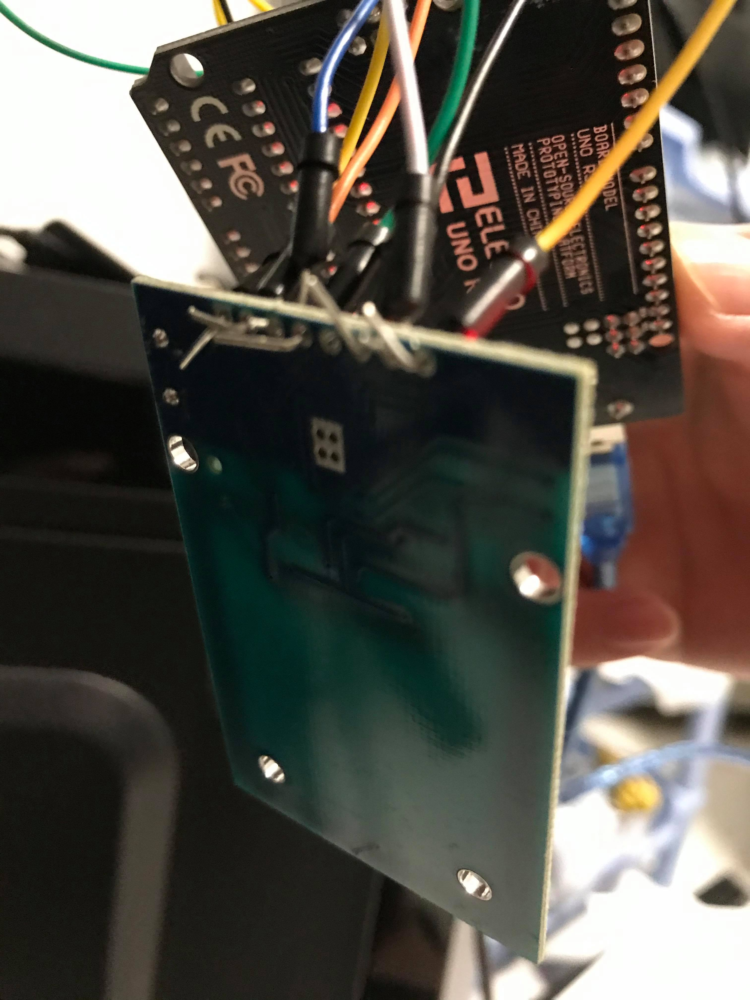
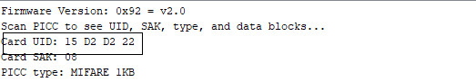

# Entry 4
##### 2/9/20

### Updates 
Wilson, which is my partner for this project, is currently on a simple program to test out the hardware components that I had done assemblying. Wilson found this starter file from the https://create.arduino.cc/editor. Inside of the MFRC522 library, there were some starter files that helped with the program Wilson is trying to code. We used the "dumpinfo" example from the MFRC522 library inside of the Arduino web editor. The "dumpinfo" was to help us retrieve the ID number of our master RFID card. Once I had downloaded the IDE and uploaded the code to the prototype that I had created, I was to test out the RFID cards with the RFID reader to retrieve the ID number, so Wilson could further code the program. When I had the serial monitor opened up and scanned the RFID card to the RFID reader, I was expecting the ID number to show up. Instead, it gave me an error message saying that there was a connection error with the RFID reader.

### Skills Used 
So during the part where I couldn't get the RFID reader to work, I was wondering what happen to my build. I used a skill called the guess and check. I went ahead and unplugged all the pins that were connected to the RFID reader from the Arduino Uno and checked online from other people's project on where and how they connected their readers to the Arduino. After doing some comparison with other people's project, I tested the RFID reader again to see if it could run properly. This [website](https://www.instructables.com/id/Arduino-Wiring-and-Programming-of-RFID-Sensor/) showed me a clear image of which pin should connect to which port on the RFID reader because on the reader itself, the words were very small. Sadly, the same thing happened. So I thought, maybe is the connection issue with the pins connected to the RFID reader because those pins do have to be soldered using a soldering iron in order for the pins to stay connected with the RFID Reader. To fix this issue, I went ahead and bended the pins into a right angle or L shape so it doesn't fall off easily. As you can see in this picture.
</img> 
Luckily, this method worked,and we got the RFID card's ID number.
</img> 
Even though is still not stable, it will be fine for just now for testing our work. We will be using a soldering iron to stable it once is finish. Before, I didn't know that bending the pins into that shape will work or not, so I decided to give it a try and it worked, sometimes doing guess and checks will solve problems just like it did for me. 

### Engineering Design Process
As of right now, I think Wilson and I are on still on the designing a prototype step because there's still more to the hardware part that I have to add it, such as the lock itself. In addition, Wilson is still working on a starter/simple program for our project, which he's almost done, that's why we needed to find our the RFID card's ID number, so he could continue to program. 

[Previous](entry03.md) | [Next](entry05.md)

[Home](../README.md)