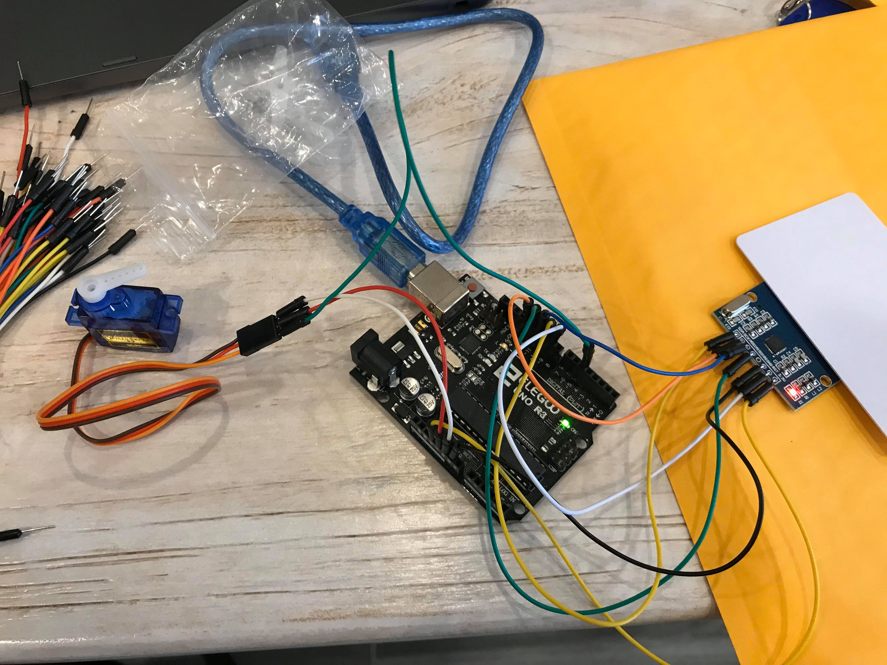

# Entry 5
##### 3/15/20

### Updates
So far Wilson and I finished with the basic fundamentals of a lock system that uses the RFID card to lock or unlock. As for the locking mechanism, we used a servo as the lock because once the servo turns to a certain degree, it represents the door is locked, and when it returns to the starting position, it represents unlock. We set up one master card and a user tag keychain that could use to unlock the lock system through the RFID reader scan.

Below is the simple lock system we have done so far. You could see the RFID on the right and the servo on the left as the locking mechanism.
</img>

### Engineering Design Process
As of right now, Wilson and I are on the step where we feel the need to add additional hardware(s) to unlock the system. We both agree on adding a Bluetooth module(HC-05) where the user(s) could connect to the system using their mobile device to unlock the lock just in case they forgot or lost their RFID card. Nowadays, people carry some sort of mobile device like a phone wherever they go, so this additional feature could be very useful when it comes to that situation. Of course, you would have to be in the range of the system in order to use the Bluetooth unlocking feature. We would also add a password login when attempting to login/connect with the Bluetooth module in order to unlock the system; this is for obvious security purposes.

### Skills and Knowledge
The skills used were, of course, the use of the internet to benefit our project. So I googled how to program the Bluetooth module to have login passcodes. I found this [website](https://create.arduino.cc/projecthub/electropeak/getting-started-with-hc-05-bluetooth-module-arduino-e0ca81) where someone posted a tutorial on how to use and understand the basics of this Bluetooth module. In the tutorial, it tells me the basics of how Bluetooth works and the libraries that are needed to code it. I learned that Bluetooth modules have something called the AT-commands. AT-commands lets the programmers send in commands through Bluetooth. Also, communication skills are key for any partnership work because we have to tell each other what we are trying to do on the project.

### Next Step
After discussing with Wilson on how to improve our lock system, we have agreed on adding some type of facial or object recognition system using a camera module. We have decided to use the ES32-CAM module for the purpose of this project because Wilson wants to do something called the Optical Character Recognition(OCR), which is like having the camera to analyze words or characters within an object or image the camera captures. Wilson's idea was to have it to analyze whether or not if any packages deliveries actually belongs to him by analyzing the package label for any credentials. The reason we are using an ES32-CAM is that we want to try this OCR through a simpler way first by storing images of major shipping carrier's logos, so if any of these logos match with what's stored onto the Es32-cam module, it will alert a confirmation.

[Previous](entry04.md) | [Next](entry06.md)

[Home](../README.md)