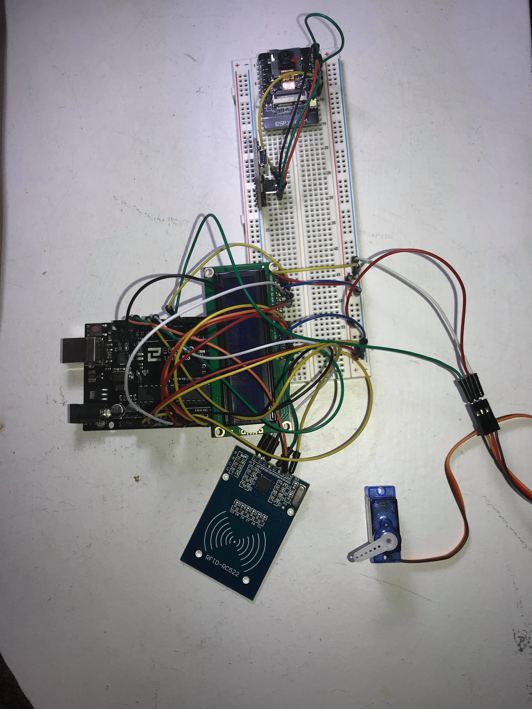

# Final Entry, #6
##### 6/2/20

### Updates
Throughout the course year, Wilson and I worked very hard on completing our freedom project. Our intended goal of this project was to create a safe and convenient smart lock system for our home. Through many obstacles we faced this year, we were able to have an MVP(Minimum Viable Product). 

### Engineering Design Process
At this time, we have our MVP, which is a smart lock system consists of RFID (Radio-Frequency Identification) bypass security using designated RFID cards to unlock the system. Our proposed final MVP product originally consisted of using RFID, Bluetooth, and facial recognition as our bypass methods for our smart lock system. Unfortunately, due to unexpected manufacture errors on the boards and modules we purchased, we were unable to use the Bluetooth and Facial recognition feature. Both Bluetooth and Esp32- cam module we bought has corrupted chips leading to unsuccessful code uploading. 

### Skills and Knowledge
Throughout the course of this project, we learned a lot of new skills. Not only that we learned about Arduino and how to code it, we also learned some soft skills that are key to a successful partnership project. We realized how important it is to communicate correctly with our partners while completing this project, especially where we are quarantined and must rely on online communication. Time management was also important as we have other works and AP tests to worry about. By learning Java in our regular AP Computer Science A class, it made it easier for us to read and code for our Arduino project as there are many similarities in between Arduino/ C++ and Java. 

Like I mentioned before, our Bluetooth and ESP32-cam modules were manufactured defected, I troubleshot many times before coming to this conclusion. At first, we thought that our code or hardware wiring was incorrect, so we researched many different approaches to this situation and tried it out. After many going through different forums and watching videos, we have come to the conclusion that our parts were faulty. This is one of the forum I visited when I troubleshoot. https://github.com/espressif/esptool/issues/394. And this is one of the videos I watched on Youtube on how to set up the ESP32-cam that I was going to use in my project. https://www.youtube.com/watch?v=tzmcXZ-irIc&list=LLGUKVCdc38eucu18HCtHpVA&index=2&t=0s

### For the Future

If our project came out to be as planned, with the RFID, Bluetooth, and Esp32-cam for facial recognition, then our project could replace a door lock and put it in use in normal daily life. With it being used in a daily life basis, we could check for flaws that need to fix in order to be fully functional and 100% stable to be used as a workable lock system. Hopefully, in the future where conditions allow, I would definitely purchase new parts and redo this project. This was a long journey

Here is the link to our project's [code]( https://gist.github.com/wilsonz8427/4857a04508a38569bafa41ad804c16dc?fbclid=IwAR2AwQ_lxBJFvpZKB6IQKXOdAltegilnVtJpZisU48lV0wFknxvEExBq3tc)

And here's a picture of our MVP. The ESP32-cam is also attached but not functional.
</img>

[Previous](entry05.md) | [Next](entry07.md)

[Home](../README.md)